<!-- Generated from humanfia.ai by tools/gen_portfolio.py; edits here are overwritten. -->

<a href="https://humanfia.ai"><picture><source media="(prefers-color-scheme: dark)" srcset="./art/dark/hero.svg"><source media="(prefers-color-scheme: light)" srcset="./art/light/hero.svg">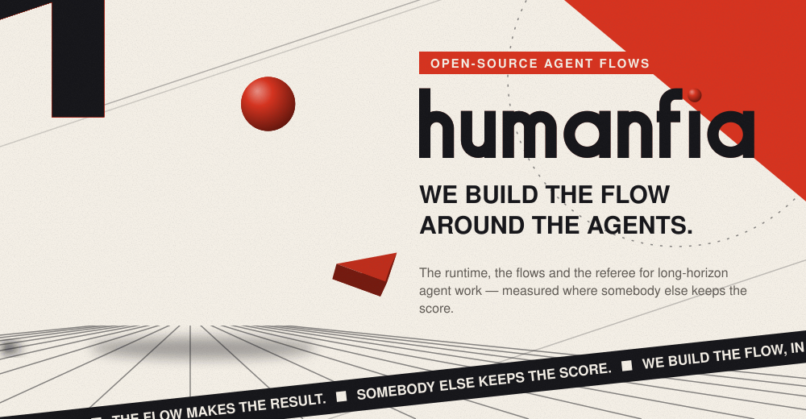</picture></a>

<picture><source media="(prefers-color-scheme: dark)" srcset="./art/dark/head-1.svg"><source media="(prefers-color-scheme: light)" srcset="./art/light/head-1.svg"></picture>

<a href="https://humanfia.ai/projects/humanize"><picture><source media="(prefers-color-scheme: dark)" srcset="./art/dark/project-0.svg"><source media="(prefers-color-scheme: light)" srcset="./art/light/project-0.svg">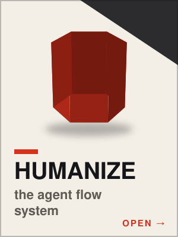</picture></a><a href="https://humanfia.ai/projects/flowbench"><picture><source media="(prefers-color-scheme: dark)" srcset="./art/dark/project-1.svg"><source media="(prefers-color-scheme: light)" srcset="./art/light/project-1.svg">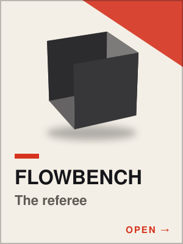</picture></a><a href="https://humanfia.ai/projects/hoa"><picture><source media="(prefers-color-scheme: dark)" srcset="./art/dark/project-2.svg"><source media="(prefers-color-scheme: light)" srcset="./art/light/project-2.svg">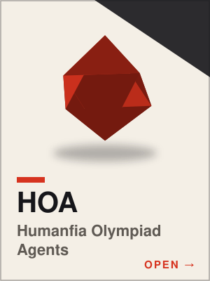</picture></a><a href="https://humanfia.ai/projects/kda"><picture><source media="(prefers-color-scheme: dark)" srcset="./art/dark/project-3.svg"><source media="(prefers-color-scheme: light)" srcset="./art/light/project-3.svg">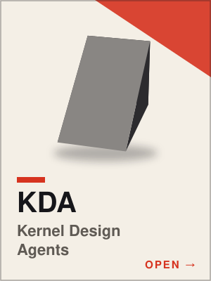</picture></a><a href="https://humanfia.ai/projects/hma"><picture><source media="(prefers-color-scheme: dark)" srcset="./art/dark/project-4.svg"><source media="(prefers-color-scheme: light)" srcset="./art/light/project-4.svg">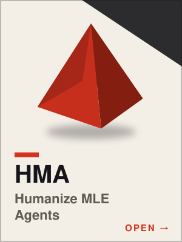</picture></a>

<picture><source media="(prefers-color-scheme: dark)" srcset="./art/dark/head-2.svg"><source media="(prefers-color-scheme: light)" srcset="./art/light/head-2.svg"></picture>

<b>Humanize, how it fits together</b> — a turn falls through the stack

<a href="https://docs.humanfia.ai/humanize/"><picture><source media="(prefers-color-scheme: dark)" srcset="./art/dark/runtime.svg"><source media="(prefers-color-scheme: light)" srcset="./art/light/runtime.svg"></picture></a>

<a href="https://docs.humanfia.ai/humanize/"><picture><source media="(prefers-color-scheme: dark)" srcset="./art/dark/features.svg"><source media="(prefers-color-scheme: light)" srcset="./art/light/features.svg"></picture></a>

<picture><source media="(prefers-color-scheme: dark)" srcset="./art/dark/head-3.svg"><source media="(prefers-color-scheme: light)" srcset="./art/light/head-3.svg"></picture>

<b>The flows</b> — a relay, maker and checker, lanes at once, a loop with a cleaner, one agent, looping, divide and conquer

<a href="https://humanfia.ai/flows/flame-chase"><picture><source media="(prefers-color-scheme: dark)" srcset="./art/dark/flow-0.svg"><source media="(prefers-color-scheme: light)" srcset="./art/light/flow-0.svg">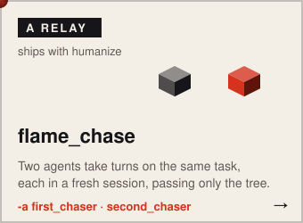</picture></a><a href="https://humanfia.ai/flows/humanize1"><picture><source media="(prefers-color-scheme: dark)" srcset="./art/dark/flow-1.svg"><source media="(prefers-color-scheme: light)" srcset="./art/light/flow-1.svg"></picture></a><a href="https://humanfia.ai/flows/parallel-flame-chase-git-pr"><picture><source media="(prefers-color-scheme: dark)" srcset="./art/dark/flow-2.svg"><source media="(prefers-color-scheme: light)" srcset="./art/light/flow-2.svg">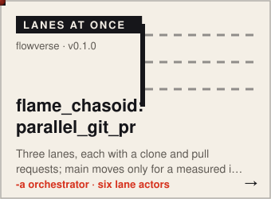</picture></a> 
<a href="https://humanfia.ai/flows/ralph-loop-agent-cleanup"><picture><source media="(prefers-color-scheme: dark)" srcset="./art/dark/flow-3.svg"><source media="(prefers-color-scheme: light)" srcset="./art/light/flow-3.svg"></picture></a><a href="https://humanfia.ai/flows/flame-chase-agent-cleanup"><picture><source media="(prefers-color-scheme: dark)" srcset="./art/dark/flow-4.svg"><source media="(prefers-color-scheme: light)" srcset="./art/light/flow-4.svg"></picture></a><a href="https://humanfia.ai/flows/ralph-loop"><picture><source media="(prefers-color-scheme: dark)" srcset="./art/dark/flow-5.svg"><source media="(prefers-color-scheme: light)" srcset="./art/light/flow-5.svg">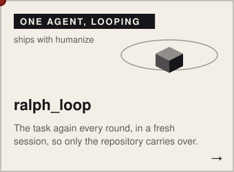</picture></a> 
<a href="https://humanfia.ai/flows/stateful-ralph"><picture><source media="(prefers-color-scheme: dark)" srcset="./art/dark/flow-6.svg"><source media="(prefers-color-scheme: light)" srcset="./art/light/flow-6.svg">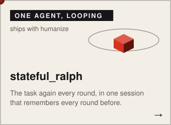</picture></a><a href="https://humanfia.ai/flows/continue-loop"><picture><source media="(prefers-color-scheme: dark)" srcset="./art/dark/flow-7.svg"><source media="(prefers-color-scheme: light)" srcset="./art/light/flow-7.svg">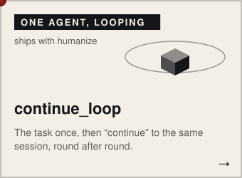</picture></a><a href="https://humanfia.ai/flows/goal"><picture><source media="(prefers-color-scheme: dark)" srcset="./art/dark/flow-8.svg"><source media="(prefers-color-scheme: light)" srcset="./art/light/flow-8.svg">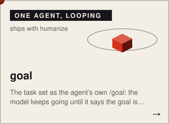</picture></a> 
<a href="https://humanfia.ai/flows/fixed-interrupt-flame-chase"><picture><source media="(prefers-color-scheme: dark)" srcset="./art/dark/flow-9.svg"><source media="(prefers-color-scheme: light)" srcset="./art/light/flow-9.svg">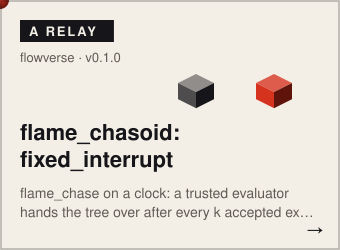</picture></a><a href="https://humanfia.ai/flows/rlar"><picture><source media="(prefers-color-scheme: dark)" srcset="./art/dark/flow-10.svg"><source media="(prefers-color-scheme: light)" srcset="./art/light/flow-10.svg"></picture></a><a href="https://humanfia.ai/flows/aot"><picture><source media="(prefers-color-scheme: dark)" srcset="./art/dark/flow-11.svg"><source media="(prefers-color-scheme: light)" srcset="./art/light/flow-11.svg"></picture></a> 
<a href="https://humanfia.ai/flows/parallel-flame-chase"><picture><source media="(prefers-color-scheme: dark)" srcset="./art/dark/flow-12.svg"><source media="(prefers-color-scheme: light)" srcset="./art/light/flow-12.svg">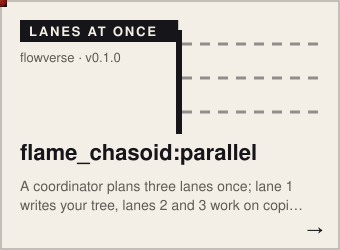</picture></a><a href="https://humanfia.ai/flows/recursive-lean-prover"><picture><source media="(prefers-color-scheme: dark)" srcset="./art/dark/flow-13.svg"><source media="(prefers-color-scheme: light)" srcset="./art/light/flow-13.svg"></picture></a>

<picture><source media="(prefers-color-scheme: dark)" srcset="./art/dark/head-4.svg"><source media="(prefers-color-scheme: light)" srcset="./art/light/head-4.svg"></picture>

<a href="https://humanfia.ai/news/2026-10-05-lean-eval-v1"><picture><source media="(prefers-color-scheme: dark)" srcset="./art/dark/result-0.svg"><source media="(prefers-color-scheme: light)" srcset="./art/light/result-0.svg">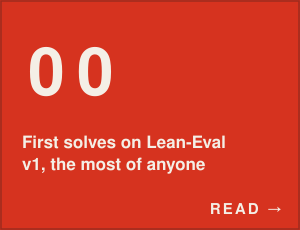</picture></a><a href="https://humanfia.ai/news/2026-10-05-hma-mle-bench"><picture><source media="(prefers-color-scheme: dark)" srcset="./art/dark/result-1.svg"><source media="(prefers-color-scheme: light)" srcset="./art/light/result-1.svg">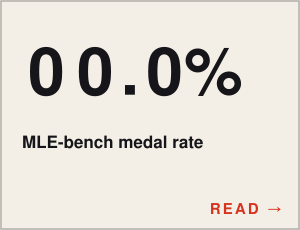</picture></a><a href="https://humanfia.ai/news/2026-10-05-kda-upstream"><picture><source media="(prefers-color-scheme: dark)" srcset="./art/dark/result-2.svg"><source media="(prefers-color-scheme: light)" srcset="./art/light/result-2.svg">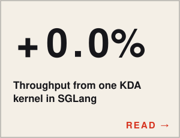</picture></a><a href="https://humanfia.ai/news/2026-10-05-kaggle-biohub-final"><picture><source media="(prefers-color-scheme: dark)" srcset="./art/dark/result-3.svg"><source media="(prefers-color-scheme: light)" srcset="./art/light/result-3.svg"></picture></a> 
<a href="https://humanfia.ai/news/2026-10-05-olympiads"><picture><source media="(prefers-color-scheme: dark)" srcset="./art/dark/result-4.svg"><source media="(prefers-color-scheme: light)" srcset="./art/light/result-4.svg">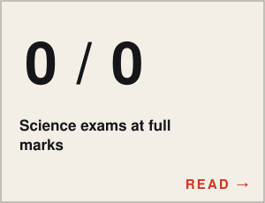</picture></a><a href="https://humanfia.ai/news/2026-10-05-putnambench-672"><picture><source media="(prefers-color-scheme: dark)" srcset="./art/dark/result-5.svg"><source media="(prefers-color-scheme: light)" srcset="./art/light/result-5.svg">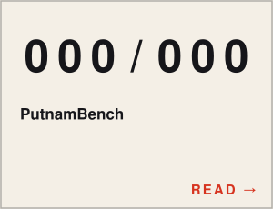</picture></a><a href="https://humanfia.ai/news/2026-08-14-msa-indexer"><picture><source media="(prefers-color-scheme: dark)" srcset="./art/dark/result-6.svg"><source media="(prefers-color-scheme: light)" srcset="./art/light/result-6.svg">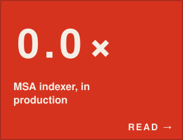</picture></a><a href="https://humanfia.ai/news/2026-08-11-programbench"><picture><source media="(prefers-color-scheme: dark)" srcset="./art/dark/result-7.svg"><source media="(prefers-color-scheme: light)" srcset="./art/light/result-7.svg">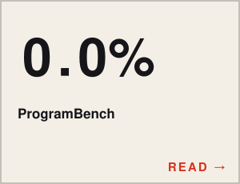</picture></a> 
<a href="https://humanfia.ai/news/2026-08-02-kda-15-past-human-sota"><picture><source media="(prefers-color-scheme: dark)" srcset="./art/dark/result-8.svg"><source media="(prefers-color-scheme: light)" srcset="./art/light/result-8.svg">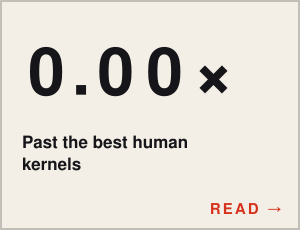</picture></a><a href="https://humanfia.ai/news/2026-07-22-imo-2026"><picture><source media="(prefers-color-scheme: dark)" srcset="./art/dark/result-9.svg"><source media="(prefers-color-scheme: light)" srcset="./art/light/result-9.svg">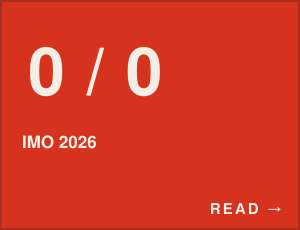</picture></a><a href="https://humanfia.ai/news/2026-07-02-solexec-l1"><picture><source media="(prefers-color-scheme: dark)" srcset="./art/dark/result-10.svg"><source media="(prefers-color-scheme: light)" srcset="./art/light/result-10.svg">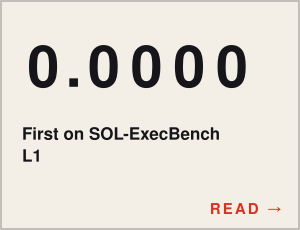</picture></a><a href="https://humanfia.ai/news/2026-06-22-sol-bench-batch"><picture><source media="(prefers-color-scheme: dark)" srcset="./art/dark/result-11.svg"><source media="(prefers-color-scheme: light)" srcset="./art/light/result-11.svg"></picture></a>

<picture><source media="(prefers-color-scheme: dark)" srcset="./art/dark/head-5.svg"><source media="(prefers-color-scheme: light)" srcset="./art/light/head-5.svg"></picture>

<a href="https://humanfia.ai/blog/2026-10-05-different-tasks-need-different-flows"><picture><source media="(prefers-color-scheme: dark)" srcset="./art/dark/post-0.svg"><source media="(prefers-color-scheme: light)" srcset="./art/light/post-0.svg"></picture></a> 
<a href="https://humanfia.ai/blog/2026-10-05-flow-is-the-new-scaling-dimension"><picture><source media="(prefers-color-scheme: dark)" srcset="./art/dark/post-1.svg"><source media="(prefers-color-scheme: light)" srcset="./art/light/post-1.svg"></picture></a> 
<a href="https://humanfia.ai/blog/2026-10-05-four-findings-on-flows"><picture><source media="(prefers-color-scheme: dark)" srcset="./art/dark/post-2.svg"><source media="(prefers-color-scheme: light)" srcset="./art/light/post-2.svg"></picture></a> 
<a href="https://humanfia.ai/news/2026-10-05-lean-eval-v1"><picture><source media="(prefers-color-scheme: dark)" srcset="./art/dark/post-3.svg"><source media="(prefers-color-scheme: light)" srcset="./art/light/post-3.svg"></picture></a> 
<a href="https://humanfia.ai/news/2026-10-05-hma-mle-bench"><picture><source media="(prefers-color-scheme: dark)" srcset="./art/dark/post-4.svg"><source media="(prefers-color-scheme: light)" srcset="./art/light/post-4.svg"></picture></a>

<picture><source media="(prefers-color-scheme: dark)" srcset="./art/dark/head-6.svg"><source media="(prefers-color-scheme: light)" srcset="./art/light/head-6.svg"></picture>

<a href="https://github.com/SihaoLiu"><picture><source media="(prefers-color-scheme: dark)" srcset="./art/dark/person-0.svg"><source media="(prefers-color-scheme: light)" srcset="./art/light/person-0.svg"></picture></a><a href="https://github.com/Lyken17"><picture><source media="(prefers-color-scheme: dark)" srcset="./art/dark/person-1.svg"><source media="(prefers-color-scheme: light)" srcset="./art/light/person-1.svg"></picture></a><a href="https://github.com/futrime"><picture><source media="(prefers-color-scheme: dark)" srcset="./art/dark/person-2.svg"><source media="(prefers-color-scheme: light)" srcset="./art/light/person-2.svg"></picture></a><a href="https://github.com/DongyunZou"><picture><source media="(prefers-color-scheme: dark)" srcset="./art/dark/person-3.svg"><source media="(prefers-color-scheme: light)" srcset="./art/light/person-3.svg"></picture></a><a href="https://github.com/antoinegg1"><picture><source media="(prefers-color-scheme: dark)" srcset="./art/dark/person-4.svg"><source media="(prefers-color-scheme: light)" srcset="./art/light/person-4.svg"></picture></a><a href="https://github.com/dongz9"><picture><source media="(prefers-color-scheme: dark)" srcset="./art/dark/person-5.svg"><source media="(prefers-color-scheme: light)" srcset="./art/light/person-5.svg"></picture></a> 
<a href="https://github.com/crmsndu"><picture><source media="(prefers-color-scheme: dark)" srcset="./art/dark/person-6.svg"><source media="(prefers-color-scheme: light)" srcset="./art/light/person-6.svg"></picture></a><a href="https://github.com/JerryGJX"><picture><source media="(prefers-color-scheme: dark)" srcset="./art/dark/person-7.svg"><source media="(prefers-color-scheme: light)" srcset="./art/light/person-7.svg"></picture></a><a href="https://github.com/ZhengyangZhang06"><picture><source media="(prefers-color-scheme: dark)" srcset="./art/dark/person-8.svg"><source media="(prefers-color-scheme: light)" srcset="./art/light/person-8.svg"></picture></a><a href="https://github.com/menik1126"><picture><source media="(prefers-color-scheme: dark)" srcset="./art/dark/person-9.svg"><source media="(prefers-color-scheme: light)" srcset="./art/light/person-9.svg"></picture></a><a href="https://github.com/hongzhoulin89"><picture><source media="(prefers-color-scheme: dark)" srcset="./art/dark/person-10.svg"><source media="(prefers-color-scheme: light)" srcset="./art/light/person-10.svg"></picture></a><a href="https://github.com/unixtomato"><picture><source media="(prefers-color-scheme: dark)" srcset="./art/dark/person-11.svg"><source media="(prefers-color-scheme: light)" srcset="./art/light/person-11.svg"></picture></a> 
<a href="https://github.com/ubospica"><picture><source media="(prefers-color-scheme: dark)" srcset="./art/dark/person-12.svg"><source media="(prefers-color-scheme: light)" srcset="./art/light/person-12.svg"></picture></a><a href="https://github.com/Waterpine"><picture><source media="(prefers-color-scheme: dark)" srcset="./art/dark/person-13.svg"><source media="(prefers-color-scheme: light)" srcset="./art/light/person-13.svg"></picture></a><a href="https://github.com/BBuf"><picture><source media="(prefers-color-scheme: dark)" srcset="./art/dark/person-14.svg"><source media="(prefers-color-scheme: light)" srcset="./art/light/person-14.svg"></picture></a><a href="https://github.com/smoothsmooth"><picture><source media="(prefers-color-scheme: dark)" srcset="./art/dark/person-15.svg"><source media="(prefers-color-scheme: light)" srcset="./art/light/person-15.svg"></picture></a><a href="https://github.com/zgdllt"><picture><source media="(prefers-color-scheme: dark)" srcset="./art/dark/person-16.svg"><source media="(prefers-color-scheme: light)" srcset="./art/light/person-16.svg"></picture></a><a href="https://github.com/apostle715"><picture><source media="(prefers-color-scheme: dark)" srcset="./art/dark/person-17.svg"><source media="(prefers-color-scheme: light)" srcset="./art/light/person-17.svg"></picture></a>

<a href="https://humanfia.ai/about/"><picture><source media="(prefers-color-scheme: dark)" srcset="./art/dark/principles.svg"><source media="(prefers-color-scheme: light)" srcset="./art/light/principles.svg">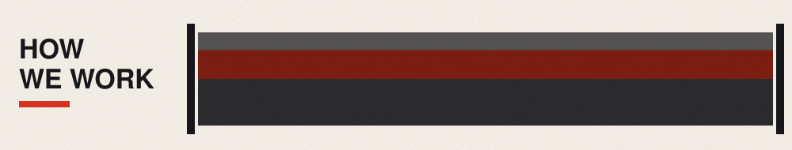</picture></a>

<a href="https://humanfia.ai"><picture><source media="(prefers-color-scheme: dark)" srcset="./art/dark/outro.svg"><source media="(prefers-color-scheme: light)" srcset="./art/light/outro.svg"></picture></a>

<a href="https://github.com/humanfia"><picture><source media="(prefers-color-scheme: dark)" srcset="./art/dark/contact-0.svg"><source media="(prefers-color-scheme: light)" srcset="./art/light/contact-0.svg"></picture></a><a href="https://github.com/humanfia/humanize/issues"><picture><source media="(prefers-color-scheme: dark)" srcset="./art/dark/contact-1.svg"><source media="(prefers-color-scheme: light)" srcset="./art/light/contact-1.svg">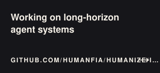</picture></a><a href="https://humanfia.ai/news/"><picture><source media="(prefers-color-scheme: dark)" srcset="./art/dark/contact-2.svg"><source media="(prefers-color-scheme: light)" srcset="./art/light/contact-2.svg">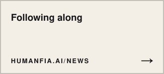</picture></a>

